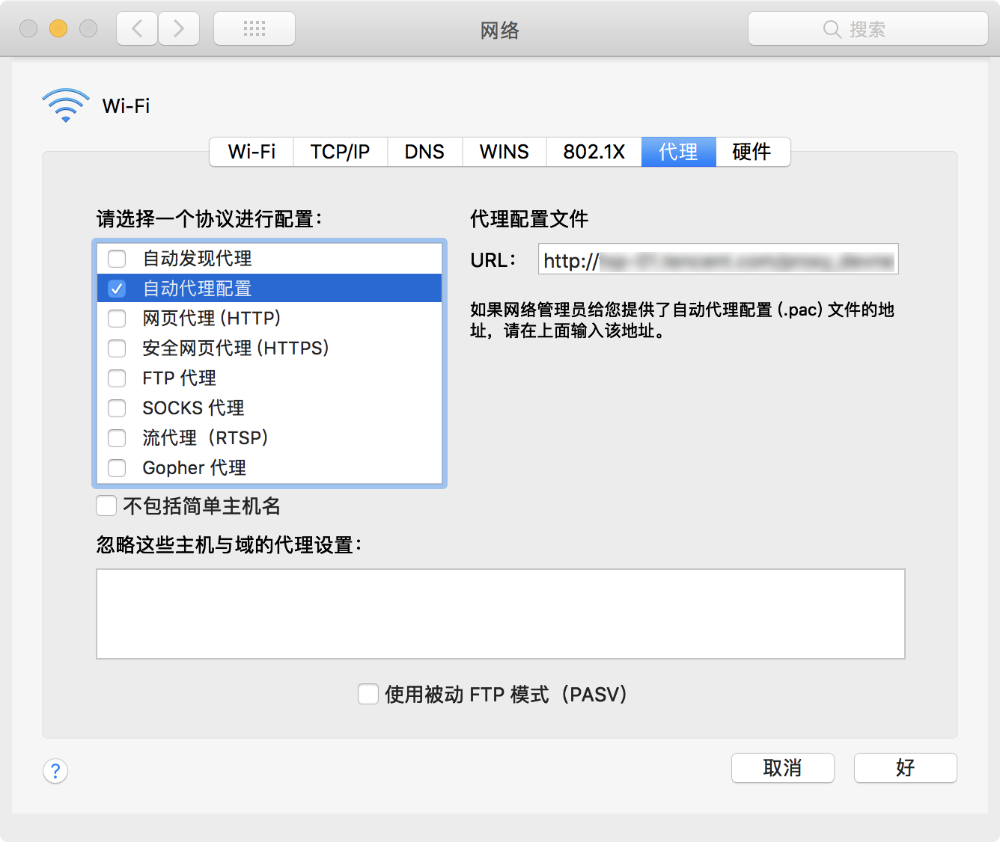
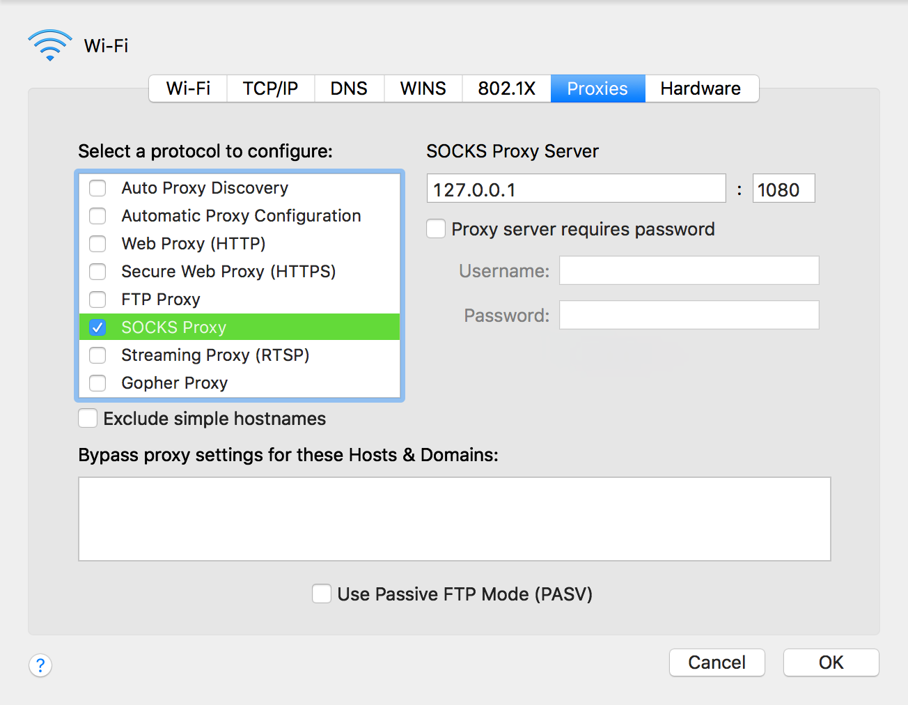
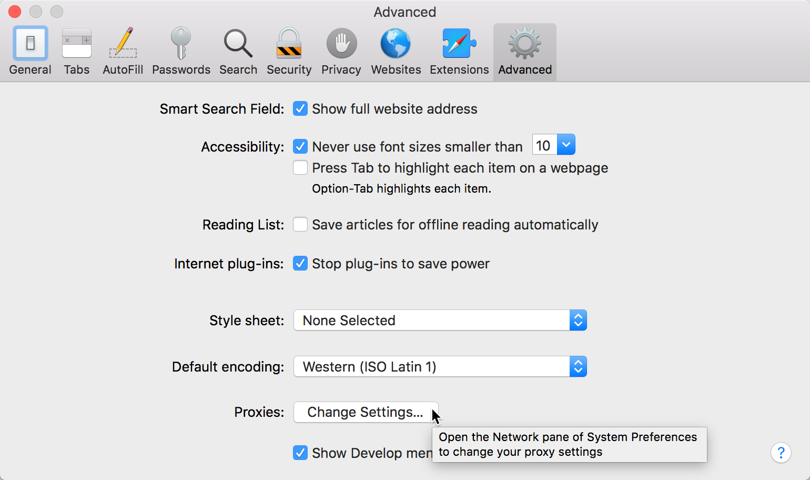
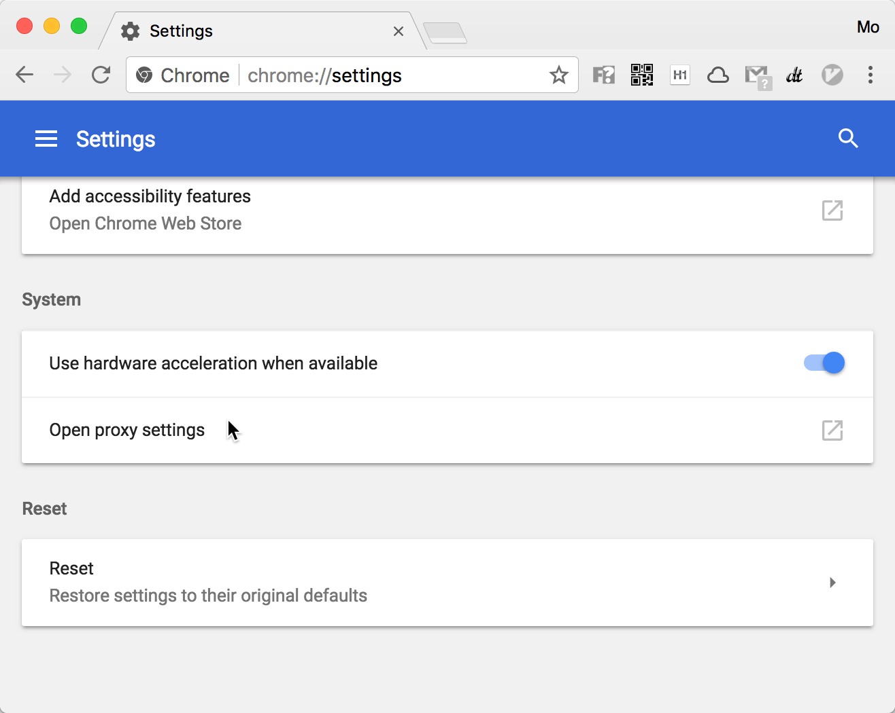
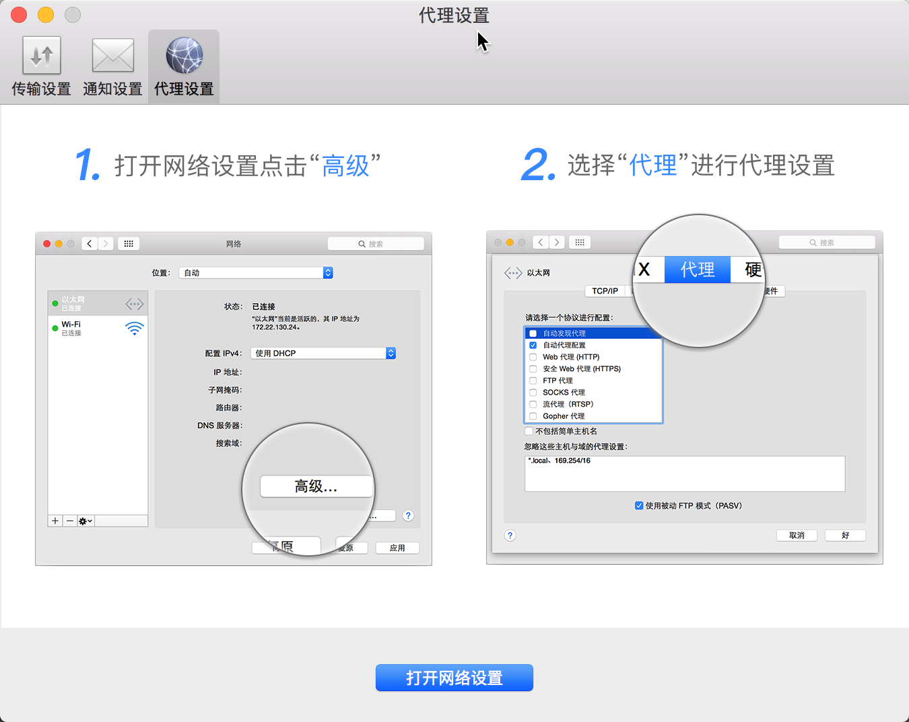
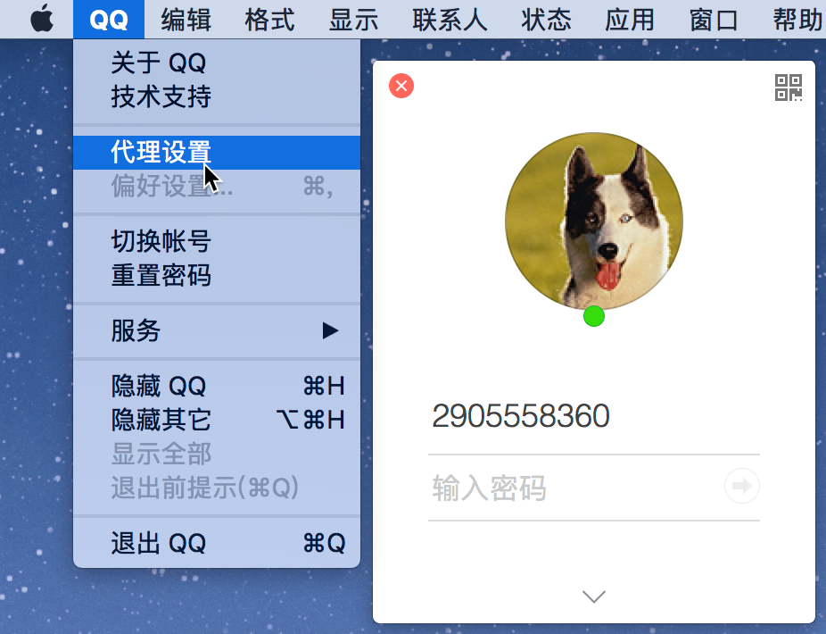
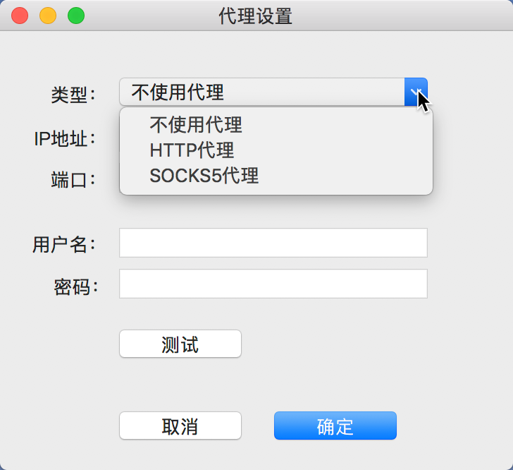

## macOS 设置代理

在 macOS 的 `系统偏好设置-网络-高级-代理` 中可[设置代理](https://support.apple.com/kb/PH25424?locale=zh_CN)。

  



> [**How to Configure a Proxy Server on a Mac**](https://www.howtogeek.com/293444/how-to-configure-a-proxy-server-on-a-mac/)  

### 浏览器代理

> The proxy server you set here will be used by Apple Safari, Google Chrome, and other applications that [respect your system proxy settings](https://www.howtogeek.com/293444/how-to-configure-a-proxy-server-on-a-mac/).  

macOS 下的浏览器（Safari & Chrome）等应用默认遵循系统偏好设置中的代理配置。  

- 在 Safari -高级-代理 中点击 **更改设置**，将跳转到 `系统偏好设置-网络-高级-代理`。  

	

	> [How to set up proxy on Safari for Mac](https://www.cactusvpn.com/tutorials/how-to-set-up-proxy-on-safari-for-mac/)

- 在 Chrome - 设置 - 高级 打开**代理设置**，也是跳转到 `系统偏好设置-网络-高级-代理`。  

	

	> [Debugging problems with the network proxy](https://www.chromium.org/developers/design-documents/network-stack/debugging-net-proxy)  
	> [Change proxy settings for Chrome and not for entire operating system](https://apple.stackexchange.com/questions/244711/change-proxy-settings-for-chrome-and-not-for-entire-operating-system)  
	> [SOCKS5 proxy with ssh tunnel and chrome in OSX](https://keksi.io/tutorials/2017/02/08/socks5-proxy-with-ssh-and-chrome-in-osx/)  

### 终端设置代理

[Setting proxy via http_proxy on Mac](https://superuser.com/questions/384398/setting-proxy-via-http-proxy-on-mac)  
[How to set proxy on OS X Terminal permanently?](https://apple.stackexchange.com/questions/226544/how-to-set-proxy-on-os-x-terminal-permanently)  
[Mac OS X Network Proxy Settings in Terminal](https://dmorgan.info/posts/mac-network-proxy-terminal/)  

[**让终端走代理的几种方法**](https://blog.fazero.me/2015/09/15/%E8%AE%A9%E7%BB%88%E7%AB%AF%E8%B5%B0%E4%BB%A3%E7%90%86%E7%9A%84%E5%87%A0%E7%A7%8D%E6%96%B9%E6%B3%95/)  
[**MAC OS X 下怎么设置 Terminal 代理**](https://www.v2ex.com/t/249079)  

1. proxychains4+sslocal  
2. `export all_proxy=socks5://127.0.0.1:1080`  

主要涉及以下3个 shell 环境变量：

- **http_proxy**(HTTP_PROXY)  
- **https_proxy**(HTTPS_PROXY)，如果未设置，一般采用 http_proxy；  
- **all_proxy**(ALL_PROXY)，如果设置，则 http、https、ftp 等所有协议均采用该代理。  

一般采用 `export` 定义代理变量，以便 shell 及 subshell 都可使用该代理。

```
faner@FAN-MB1:~ » export http_proxy=http://proxy.company.com:6543
faner@FAN-MB1:~ » export https_proxy=$http_proxy
faner@FAN-MB1:~ » export ftp_proxy=$http_proxy
faner@FAN-MB1:~ » export all_proxy=$http_proxy
```

#### SSH Proxy

[SecureCRT 设置 HTTP 代理访问 SSH 服务器](http://blog.csdn.net/ChunPIG/article/details/8469281)  
[xShell 设置 HTTP 代理访问 SSH 服务器](http://blog.netsarang.com/87/connecting-through-http-proxy-server/)  

### brew 设置代理

`man brew` 中的 *`USING HOMEBREW BEHIND A PROXY`* 章节有介绍 homebrew 命令设置代理变量的说明：

```Shell
USING HOMEBREW BEHIND A PROXY
       Homebrew uses several commands for downloading files (e.g. curl, git, svn). Many of these tools can download
       via a proxy. It's common for these tools to read proxy parameters from environment variables.

       For  the  majority of cases setting http_proxy is enough. You can set this in your shell profile, or you can
       use it before a brew command:

           http_proxy=http://<host>:<port> brew install foo

       If your proxy requires authentication:

           http_proxy=http://<user>:<password>@<host>:<port> brew install foo

```

> [如果 brew install 撞墙](http://leegorous.net/blog/2012/08/10/how-to-skip-download-in-brew-install/)  
> [让 Homebrew 走代理更新](https://www.logcg.com/archives/1617.html)  
> [homebrew使用socks-proxy](http://blog.suchasplus.com/2014/10/homebrew-using-socks-proxy.html)  

**方法1**：每次执行 brew 命令之前设置 http 和 https（可选） 代理

```Shell
export http_proxy="http://<host>:<port>"
export https_proxy="http://<host>:<port>" # 可选，默认同 http_proxy
```

**方法2**：或设置 ALL_PROXY 变量

```Shell
export ALL_PROXY=http://<host>:<port>
```

> 也可将以上添加到 bash profile(`.bashrc`) 或者 zsh profile(`.zshrc`) 中。

### curl 设置代理

执行 `curl --help | grep proxy` 或 `man curl` 可查看 proxy 相关的说明。

```Shell
# man curl

ENVIRONMENT
       The  environment  variables  can be specified in lower case or upper case. The lower case version has prece-
       dence. http_proxy is an exception as it is only available in lower case.

       Using an environment variable to set the proxy has the same effect as using the -x, --proxy option.


       http_proxy [protocol://]<host>[:port]
              Sets the proxy server to use for HTTP.

       HTTPS_PROXY [protocol://]<host>[:port]
              Sets the proxy server to use for HTTPS.

       [url-protocol]_PROXY [protocol://]<host>[:port]
              Sets the proxy server to use for [url-protocol], where the protocol is a protocol that curl  supports
              and as specified in a URL. FTP, FTPS, POP3, IMAP, SMTP, LDAP etc.

       ALL_PROXY [protocol://]<host>[:port]
              Sets the proxy server to use if no protocol-specific proxy is set.

       NO_PROXY <comma-separated list of hosts>
              list of host names that shouldn't go through any proxy. If set to a asterisk '*' only, it matches all
              hosts.

              Since 7.53.0, this environment variable disable the proxy even if specify -x, --proxy option. That is
              NO_PROXY=direct.example.com  curl  -x http://proxy.example.com http://direct.example.com accesses the
              target URL directly, and NO_PROXY=direct.example.com curl  -x  http://proxy.example.com  http://some-
              where.example.com accesses the target URL through proxy.

```

同 bash 终端通用代理变量：`http_proxy`、`HTTPS_PROXY` 和 `ALL_PROXY`。  
`NO_PROXY` 设置不走代理的例外（Exclude/Bypass）。  

也可在执行 curl 命令时携带 `-x(--proxy)` 选项指定代理。

### git 设置代理

根据 git 官网网站的安装指南（[Installing Git](https://git-scm.com/book/eo/v1/Ekkomenci-Installing-Git)）介绍：

> To install Git, you need to have the following libraries that Git depends on: **curl**, zlib, openssl, expat, and libiconv.

git 依赖 curl。

```Shell
# macOS
faner@MBP-FAN:~|⇒  brew info git
git: stable 2.15.1 (bottled), HEAD
Distributed revision control system
https://git-scm.com
Not installed
From: https://mirrors.ustc.edu.cn/homebrew-core.git/Formula/git.rb
==> Dependencies
Optional: pcre2 ✘, gettext ✔, openssl ✔, curl ✘
==> Requirements
Optional: perl >= 5.6 ✔
==> Options
--with-blk-sha1
	Compile with the block-optimized SHA1 implementation
--with-curl
	Use Homebrew's version of cURL library

# CentOS
[root@vcentos ~]# yum deplist git

  dependency: libcurl.so.4()(64bit)
   provider: libcurl.x86_64 7.29.0-42.el7_4.1

# raspbian
pi@raspberrypi:~ $ apt-cache depends git
git
  PreDepends: dpkg
  Depends: libc6
  Depends: libcurl3-gnutls

```

终端执行 `git help config` 查看 git 子命令 config 的帮助，其中 `CONFIGURATION FILE | Variables` 部分有关于 **http.proxy**（涵盖 https.proxy 和 all_proxy）的说明：

```Shell
# git help config

CONFIGURATION FILE

   Variables

       http.proxy
           Override the HTTP proxy, normally configured using the http_proxy,
           https_proxy, and all_proxy environment variables (see curl(1)). In addition
           to the syntax understood by curl, it is possible to specify a proxy string
           with a user name but no password, in which case git will attempt to acquire
           one in the same way it does for other credentials. See gitcredentials(7)
           for more information. The syntax thus is
           [protocol://][user[:password]@]proxyhost[:port]. This can be overridden on
           a per-remote basis; see remote.<name>.proxy
```

#### 设置全局代理

```Shell
git config --global http.proxy http://<host>[:port]/
git config --global https.proxy http://<host>[:port]/
```

[设置git使用socks5代理](https://gist.github.com/bluethon/45766d0a4541ab633e32a49b6c4e4bdd)：

```Shell
git config --global http.proxy 'socks5://127.0.0.1:1080'
git config --global https.proxy 'socks5://127.0.0.1:1080'
```

也可不指定 `--global` 选项，只针对当前 git repo 设置代理信息（http.proxy）。

#### 取消全局代理

```Shell
git config --global --unset http.proxy
git config --global --unset https.proxy
```

### 其他应用代理

> Some applications, including Mozilla Firefox, can have their own custom proxy settings independent from your system settings.

mac百度网盘代理设置：



macQQ代理设置：

  
  
